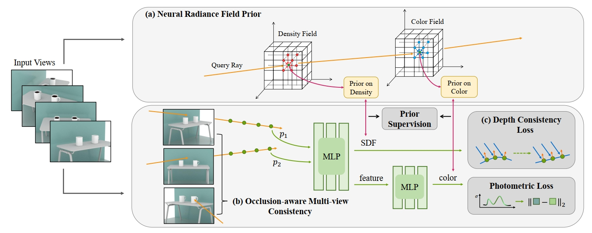

<p align="center" />
<h1 align="center">NeRFPrior: Learning Neural Radiance Field as a Prior for Indoor Scene Reconstruction</h1>


<h3 align="center"><a href="https://arxiv.org/abs/2503.18361">Paper</a> | <a href="https://wen-yuan-zhang.github.io/NeRFPrior/">Project Page</a></h3>
<div align="center"></div>
<div align="center"></div>
<p align="center">
    
</p>

In this paper, we introduce NeRFPrior. Given multi-view images of a scene as input, we first train a grid-based NeRF to obtain the density field and color field as priors. We then learn a signed distance function by imposing a multi-view consistency constraint using volume rendering. For each sampled point on the ray, we query the prior density and prior color as additional supervision of the predicted density and color, respectively. To improve the smoothness and completeness of textureless areas in the scene, we propose a depth consistency loss, which forces surface points in the same textureless plane to have similar depths.


# Preprocessed Datasets

Our preprocessed ScanNet and Replica datasets are provided in [This link](https://huggingface.co/datasets/zParquet/MonoInstance/tree/main).


# Setup

## Installation

Clone the repository and create an anaconda environment using
```shell
git clone https://github.com/wen-yuan-zhang/NeRFPrior.git
cd NeRFPrior

conda create -n nerfprior python=3.10
conda activate nerfprior

conda install pytorch=1.13.0 torchvision=0.14.0 cudatoolkit=11.7 -c pytorch
conda install cudatoolkit-dev=11.7 -c conda-forge

pip install -r requirements.txt
```

You should also clone TensoRF to obtain NeRF prior.
```shell
git clone https://github.com/apchenstu/TensoRF.git
```


# Training

Firstly, train TensoRF on the given scene to obtain the ```.th``` checkpoint for further neural implicit surface reconstruction.

To train BlendSwap dataset, use
```shell
CUDA_VISIBLE_DEVICES=1 python exp_runner.py --conf confs/blendswap.conf
```
To train Replica dataset, use
```shell
CUDA_VISIBLE_DEVICES=1 python exp_runner.py --conf confs/replica.conf
```


# Evaluation

To evaluate the reconstructed meshes first use ```cull_mesh.py``` to cull the meshes according to view frustums. Then use ```mesh_metrics.py``` to specify the path to meshes and evaluate the metrics. 
```shell
python cull_mesh.py
python mesh_metrics.py
```


# Acknowledgements

This project is built upon [NeuS](https://lingjie0206.github.io/papers/NeuS/) and [TensoRF](https://apchenstu.github.io/TensoRF/).  We thank all the authors for their great repos.


# Citation

If you find our code or paper useful, please consider citing
```bibtex
@inproceedings{zhang2025nerfprior,
  title={{NeRFPrior}: Learning neural radiance field as a prior for indoor scene reconstruction},
  author={Zhang, Wenyuan and Jia, Emily Yue-ting and Zhou, Junsheng and Ma, Baorui and Shi, Kanle and Liu, Yu-Shen and Han, Zhizhong},
  booktitle={Proceedings of the Computer Vision and Pattern Recognition Conference},
  pages={11317--11327},
  year={2025}
}
```

